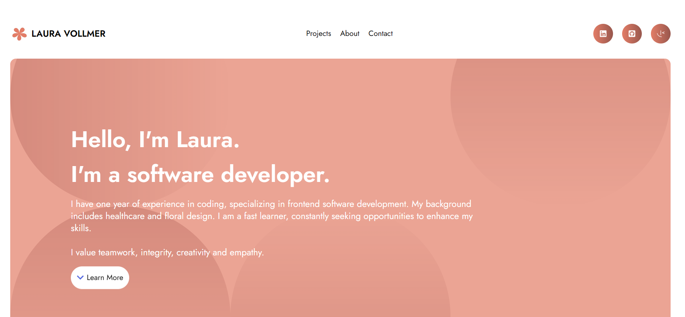
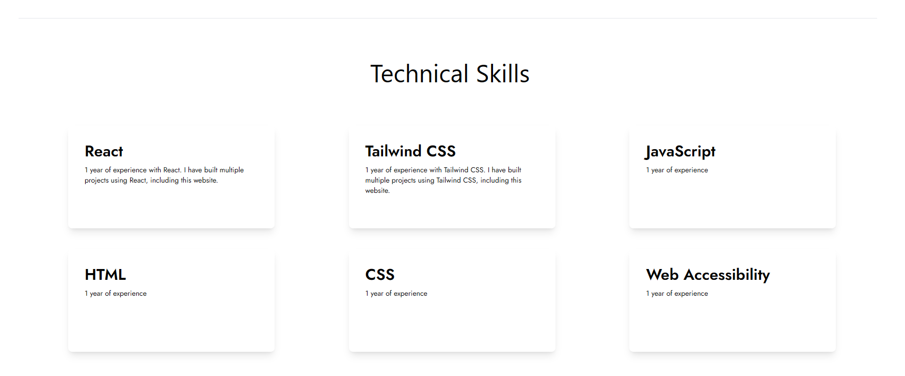
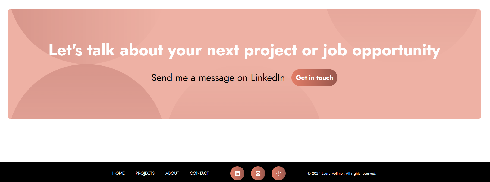
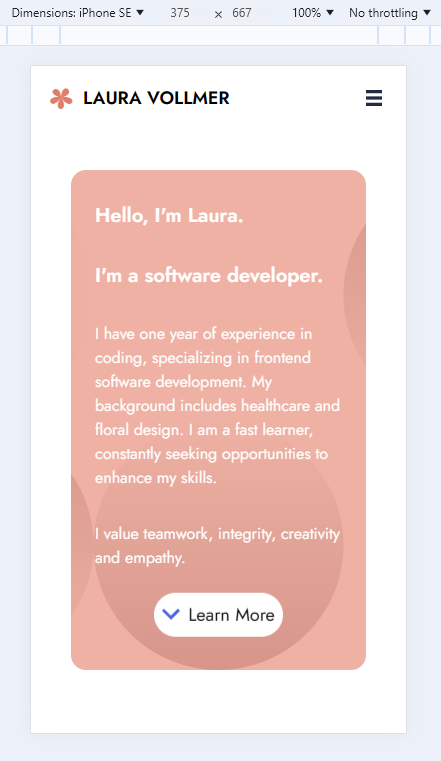
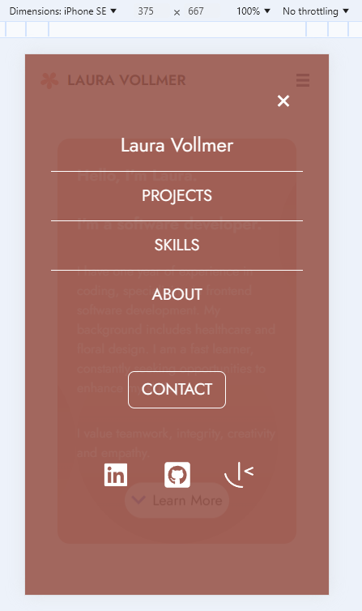

# Portfolio Website Laura Dev

This project involved working on my portfolio website with ReactJS, Vite and TailwindCSS. Throughout the process, I worked on various key features such as mobile responsiveness, reusable components, side navigation bar, scroll navigation, tailwindcss animation, gradient colors and much more.

## Table of contents

- [Overview](#overview)
  - [Screenshots](#screenshots)
  - [Links](#links)
- [My process](#my-process)
  - [Built with](#built-with)
  - [What I learned](#what-i-learned)
  - [Continued development](#continued-development)
  - [Useful resources](#useful-resources)
- [Author](#author)

## Overview

This project was a software developer portfolio for myself. I included technical skills, latest projects, about section and contact.

### Screenshots

Desktop Version:

Mobile Version:

### Links

- Live Site URL: [Personal Portoflio Website Laura Dev](https://lauradev-portfolio.netlify.app/)

### My Process

I started by setting up TailwindCSS, ReactJS, and my GitHub repository, ensuring all commits were successfully pushed to GitHub before beginning the project. When designing my portfolio website, I aimed for a clean, modern look that was easy to navigate. Initially, I experimented with various styles, fonts, colors, images, and ideas without settling on one. Before diving in, I wanted to ensure I loved the design and style while representing myself. After some time, I found a style and design I enjoyed and pursued that. Having completed several ReactJS and TailwindCSS projects prior, I wanted to incorporate some of those features into my portfolio website.

I began the project with the navigation and splash landing page. I decided on the key elements to highlight in the navigation bar and added animated icons for a fun touch. The splash page featured a warm color, an overlay SVG, and text, along with a "learn more" button to guide users to the rest of the website.

Next, I completed the technical skills section, highlighting my knowledge in a consistent manner. This marked the beginning of creating reusable components to streamline and maintain a consistent design process.

The latest projects section was the most involved. Each project card includes an image, image description, title, content, key features, programming languages used, GitHub code link, and live site link. I aimed for uniformity and readability in each card, showcasing all my skills and knowledge. Additionally, I wanted to make it easy to add more projects as I continue coding.

The about section was simpler, featuring a biography and avatar picture. I completed the contact section with a button to navigate to LinkedIn. The footer includes links to different parts of the web page, icons to various social media sites, and a copyright statement.

Overall, I loved what I created and excited to share it with others. I completed this website in 1.5 days. I look forward to adding more features as time progresses.

### Built with

- [React](https://reactjs.org/) - JS library
- Tailwind CSS
- Google Fonts
- Tailwind CSS Animation
- Semantic HTML5 markup
- CSS custom properties
- Flexbox
- CSS Grid
- Mobile-first workflow
- React Icons

### What I learned

In this project, I realized how much my coding skills have improved over the past year. My first portfolio website was clunkier and took much longer to code. I am much happier with my new portfolio page.

Here are several things I learned throughout this project:

1. ***Tailwind CSS Animation*** - I explored Tailwind CSS animation features and found them exciting. I experimented with various options and settled on the pulse and bounce animations with a set duration, adding a simple yet fun element to the website.
2. ***SVG Overlay*** - I wanted to incorporate an SVG overlay into my splash page and contact area. I found an SVG overlay I liked, used the raw code, and converted it to an SVG.
3. ***Reusable Components*** - I deepened my understanding of card components and their reusability. This feature proved to be highly beneficial, and I plan to continue using it.
4. ***Reusability of Code***- In this project, I reused code from previous projects and adapted it to fit my website's needs. This approach allowed me to work efficiently and effectively.
5. ***Scroll Navigation*** - Scroll link navigation, which smoothly scrolls the user to a specific section of the same page, significantly enhanced the user experience in this single-page application.

### Continued development

I will continue to learn more about TailwindCSS, ReactJS and updating my process of building a website. I will continue creating original projects, frontend mentor challenges and much more.

### Useful resources

- [Jost Google Font](https://fonts.google.com/selection) - Design called for this font in the project.
- [SVG Converter](https://jakearchibald.github.io/svgomg/) - Convert an overlay I wanted into a SVG to use in this project.
- [Frontend Mentor DESIGNO Challenge](https://www.frontendmentor.io/challenges/designo-multipage-website-G48K6rfUT) - Inspiration for this project.
- [Coolors](https://coolors.co/98574d-e37d67-d2d3cf-eaac9d-b7b5b1-d9816f-fefefe) - A design color palette for my website.
- Canva - Made my icon to match the color in Canva. -[Animations TailwindCSS](https://tailwindcss.com/docs/animation) - Learned about how to animate in Tailwindcss.

## Author

- Website - [Laura V](www.lauradeveloper.com)
- Frontend Mentor - [@lavollmer](https://www.frontendmentor.io/profile/lavollmer)
- Github - [@lavollmer](https://github.com/lavollmer)
